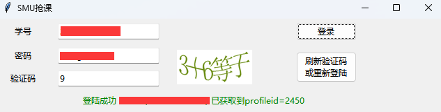
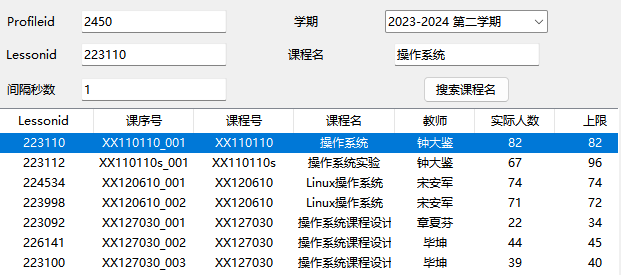
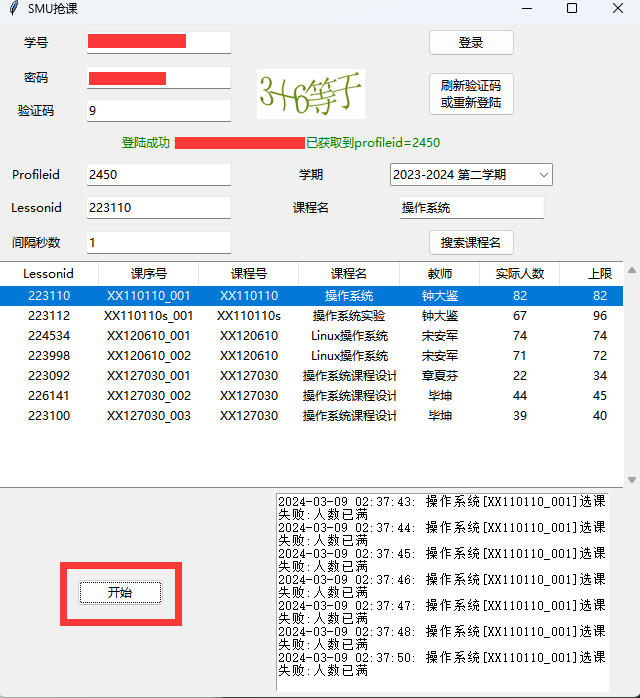

# smu_course_election_helper
Request实现的SHMTU教务系统抢课辅助软件

# 声明 Statement
本软件不得用于商业用途，仅供学习交流，切勿用于非法用途，对此产生的一切后果作者本人概不负责。

This project can not be used for commercial purposes, it is intended solely for learning and communication. Do not use it for illegal purposes. The author is not responsible for any consequences that arise from its use.

# 更新日志 Update

与V1.0相比，V2.0有以下改动：

1、用tkinter库替代了PyQT库。修复在不同分辨率、放大倍数的情况下，界面出现显示不全等问题；

2、优化内置登录，无需再手动获取Cookies；

3、优化获取profileid，登录完成后，自动尝试获取profileid；

4、优化获取Lessonid，可以通过搜索课程名，显示Lessonid

# 用法 Usage

打包好的exe安装包在release里，可以点击下方链接下载，直接安装使用

https://github.com/EricHongXDD/smu_course_election_helper/releases/download/V2.0/Smu_Course_Election_Helper_Setup_2.0.exe

如果有杀毒程序误报病毒，或者是浏览器阻挡了下载的文件，请下载以下这个版本，下载后需手动在管理员模式下启动（如未安装在C盘，则启动无需管理员权限启动软件）

https://github.com/EricHongXDD/smu_course_election_helper/releases/download/V2.0/No-administrator-privileges.Smu_Course_Election_Helper_Setup_2.0.exe

## 登录

输入学号、密码、验证码后，点击 “登录” 按钮；

验证码通过 “刷新验证码或重新登陆” 按钮获取；

登录成功后，会自动获取可用的profileid（一般教务系统在开始选课的前3天会放出选课界面，此时就可以自动获取到）。

注：如果登录后再次点击了 “刷新验证码或重新登陆” 按钮，会导致登录状态失效，此时需要重新登录。

## 搜索课程名

下拉学期框，选择当前学期；

在课程名一栏中，输入课程名（如：操作系统）；

点击 “搜索课程名” 按钮；

可以在下方看到不同课程的Lessonid；

单击选中需要抢的课，会自动在Lessonid中填入。

注：profileid、Lessonid的值也可以自行输入。

## 间隔秒数：

相邻两次请求发送的间隔时间，单位为秒（s），可接受float类型小数

## 开始抢课

登录成功，profileid、Lessonid、间隔秒数都填入后，点击 “开始” 按钮；

抢课结果会在右侧 “控制台内容输出文本框” 中显示。

## 写在最后

感谢@[孔昊旻(Haomin Kong)](https://github.com/a645162)提供的统一身份认证登录流程

如需使用上海海事大学的其它工具，可参考以下项目：

https://github.com/a645162/Digital-SHMTU-Tools
